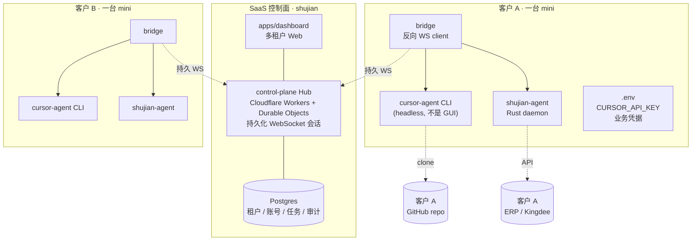

# 本地化部署方案 · 草案 (Mac mini + 反向 WebSocket)

> 状态：草案 / 想法记录，**未实施**。当前主线走 Cursor 云端 SDK 模式。  
> 创建：2026-05-06

## 0. 这份文档干啥的

记录"客户处的 Mac mini / PC 跑 agent，shujian-dashboard 在云端做 SaaS 控制面"这条路线的设计思路。
等云端 SDK 主线跑通、有真实客户需求倒逼时再激活。

## 1. 走本地路线的合理理由（哪些不该走）

走的理由（满足任一即可）：

- **数据主权 / 合规**：金融、制造、医疗等行业不允许代码、对话、业务数据离开客户网络
- **内网访问**：agent 必须直接打客户局域网里的 ERP / Kingdee / Postgres，云端 sandbox VM 做不到
- **延迟敏感**：操作客户本地系统、毫秒级响应
- **离线 / 弱网**：客户机房没有稳定外网

不该走的理由（这些场景留给 Cursor 云端 SDK）：

- "私有 repo 调不了" — 错误假设，Cursor Background Agents 通过 GitHub App 授权后**支持私有 repo**
- "想自己训练 LLM" — 跟部署位置无关
- "客户运维门槛低" — 本地路线运维负担反而更重

## 2. 整体拓扑



## 3. 客户机器上跑什么

每台 mini **同时**跑两个 agent runtime + 一个 bridge，不是二选一：

| Daemon | 来源 | 职责 |
|--------|------|------|
| `cursor-agent` CLI | Cursor 官方下载 | 代码任务（PR、跨文件改、文档生成）|
| `shujian-agent` | 我们打包 | 业务任务（cron、HITL、ERP 操作、库存预警）|
| `bridge` | 我们打包 | 反向连 SaaS Hub，本地分发任务到上面两个 daemon |

**不要让客户装 Cursor IDE**——那是 GUI，无人值守不稳定。我们打的安装包里只放 `cursor-agent` headless CLI。

打包形式：
- macOS: `.dmg`（含 `cursor-agent` + `shujian-agent` + `bridge` + 一个 launchd plist）
- Windows: `.exe` 安装器（含相同三件套 + 一个 service.exe）
- Linux: `.deb` / `.rpm` + systemd unit

## 4. 反向连接（不要用 Cloudflare Tunnel）

Tunnel 模式让 SaaS 主动调客户 mini，每台 mini 要挂稳定 hostname、配 cloudflared、客户 IT 要懂——门槛高。

反向连接更顺：

1. mini 启动后 bridge 主动 dial SaaS 的 WSS endpoint（任何能上网的环境都能连）
2. 一直保持长连接，SaaS 通过 channel 派活（"你给我跑这个 cursor task"）
3. 客户**什么端口都不开**

SaaS Hub 推荐用 **Cloudflare Workers + Durable Objects**：
- 一个 DO instance = 一个客户 mini 的会话
- DO 自带 hibernate-able WebSocket，不烧 CPU
- 跨地理位置 routing 自然

参考实现：Tailscale control plane / Buildkite agent / GitHub Actions self-hosted runner 都是这个模式。

## 5. Enrollment 流程（agent 怎么向 SaaS 证明身份）

```text
1. 客户在 dashboard 上点 "Add new agent host"
   → SaaS 生成一次性 enrollment token (TTL 15min)
   → dashboard 显示一行命令:
     shujian-agent enroll --token=ej... --hub=wss://hub.shujian.app

2. 客户在 mini 上跑这条命令
   → bridge 用 token 连一次 Hub
   → Hub 验证 token, 签发长期凭据 (mTLS 证书 / JWT)
   → bridge 把凭据存到 ~/.shujian/agent.key (chmod 600)

3. 之后每次 bridge 启动
   → 读取本地凭据 → 连 Hub → 进入 ready 状态
   → token 一次性失效, 不再使用
```

跟 `tailscale up --authkey ...` 一模一样。Token 不能复用、TTL 短、长期凭据 rotate 期 30 天。

## 6. 隔离原则：1 客户 = 1 物理 mini

**不要**把多个客户塞同一台机器靠 OS 用户级权限隔离。同一磁盘 / 同一网卡 / 同进程空间，泄漏面太大。

如果客户体量大要降本：
- 选项 A：客户自购 mini，物理隔离最安全
- 选项 B：我们租云上 dedicated VM 给客户（一客户一 VM），仍是物理级隔离
- 选项 C：（不推荐）超大客户允许多 instance 共享 mini，只在合同里写明

## 7. Cursor API key 永不进 SaaS

本地路线的最大政治资本：

- 客户的 `CURSOR_API_KEY` 装在他自己 mini 的 `.env` 里
- SaaS 控制面**完全看不见**这把 key
- 派活时 SaaS 只传"任务描述"，bridge 在本地把 key 注入 cursor-agent
- 客户的 GitHub token、ERP 凭据同理

→ 我们不背 secret 泄漏的合规责任，客户更愿意付钱。

## 8. 风险清单

| 风险 | 缓解 |
|------|------|
| `cursor-agent` CLI 是 Cursor 官方私有产物，他们改 API 我们就要追 | 锁版本、release 前回归测试、保留 fallback 用 `@cursor/sdk` 直调 |
| 客户 mini 离线 / 死机 | dashboard 显示离线状态，任务标记 pending，重连后追上 |
| 自动更新 | bridge 定时拉 manifest，对比版本号决定是否触发自我升级 |
| 跨平台打包工程量 | macOS 先行（开发机一致），Windows 第二批，Linux 最后 |
| Cursor SDK 内置 GUI 假设 | 先验证 cursor-agent CLI 在 headless macOS 服务用户下能跑（无 keychain prompt 等）|
| 客户 IT 不会开 mini 自启动 | .pkg 安装器自动写 launchd / 注册 Windows Service |

## 9. 待 cloud-SDK 主线跑通后, 启动本地路线时要回答的问题

1. **客户画像确定了吗？** 第一批 10 家是金融 / 制造 / 还是 SaaS 公司？决定本地化优先级
2. **mini 谁出？** 客户自购 / 我们卖 / 我们租云上 VM 三选一
3. **SaaS Hub 部署在哪？** Cloudflare Workers + DO / Railway + Node WS / 自建 K8s
4. **packaging 工具链选啥？** macOS 用 `pkgbuild` / `create-dmg`；Windows 用 `wix` / `inno-setup`
5. **`cursor-agent` CLI 的 headless 能力跑通了吗？** 单机验证：launchd 启动 + 跑一个 cloud agent 任务全流程

## 10. 与当前主线的关系

当前主线（cloud SDK）和本地路线**不是替代关系**，是**两条产品线**：

- **cloud SDK 主线**：客户用 SaaS dashboard，授权 GitHub App，Cursor 在自家 sandbox 跑。卖给"愿意把代码托管给 Cursor"的客户。
- **本地路线**：客户买 mini，agent 在客户内网跑，SaaS 只做控制面。卖给"代码绝不能出网"的客户。

代码上 `apps/dashboard` 同一份，根据租户档位决定 UI 暴露哪些路径；`apps/bridge` 同一份，但本地路线下加 `--enroll` `--hub` 等 flag；`apps/agent` 同一份。**没有架构分叉**，只是部署拓扑不同。
